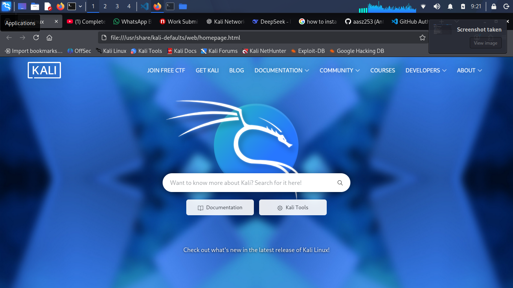

# NetworkWalks Week 1 – Cybersecurity Testing Lab

This repository documents my Week 1 (PM1) lab for the NetworkWalks Cybersecurity & Ethical Hacking course. The work covers a complete Kali Linux testing environment on VirtualBox: a dedicated NAT network (`10.0.0.0/24`), a Kali guest with a static address, confirmed Internet access, and the VirtualBox features (shared clipboard, drag and drop, shared folder) that make the VM practical to use for the later labs. A clean snapshot was taken after everything was verified, so the whole lab can be rolled back to a known-good state at any time.

## 1. Project Overview

The point of this lab was to build a controlled environment for penetration testing practice and to document each piece of it properly. The environment runs inside VirtualBox, so nothing it does can touch my physical network directly. Kali Linux is the testing platform, and it lives on its own NAT network with a fixed address, which makes the setup reproducible from one session to the next.

Everything below is documented from the actual lab: the network design, the exact commands used to verify it, the guest integration settings, and the final snapshot.

## 2. Lab Architecture

```text
Physical Host
     |
     | VirtualBox
     |
     +----------------------+
     | NAT Network          |
     | 10.0.0.0/24          |
     +----------------------+
              |
              |
        Kali Linux VM
        10.0.0.2/24
              |
           Internet
```

The physical host runs VirtualBox, which manages the VM's virtual hardware: CPU, memory, disk, network adapter, shared folders and snapshots. Inside VirtualBox there is one NAT Network with the subnet `10.0.0.0/24`. The Kali VM is attached to that network and holds the static address `10.0.0.2/24`, with the NAT gateway at `10.0.0.1`.

All traffic from the VM to the Internet leaves through the host's own network connection. The VM is not reachable from the physical LAN, so the lab stays isolated while Kali still gets full Internet access for tools, updates and packages.

## 3. Hardware and Software

The lab runs on a standard desktop/laptop host. Exact figures are recorded on the host machine and noted in the table below.

| Component | Details |
| --- | --- |
| Host operating system | _to be completed_ |
| Host CPU | _to be completed_ |
| Host RAM | _to be completed_ |
| Host storage | _to be completed_ |
| VirtualBox version | _to be completed_ |
| Kali Linux version | _to be completed_ |

VirtualBox is the current stable release from the official site, and the Kali VM was created from the official Kali Linux image for this course. The exact version numbers will be filled in before submission.

## 4. Network Configuration

| Parameter | Value |
| --- | --- |
| Network Type | NAT Network |
| Network | 10.0.0.0/24 |
| Kali IP Address | 10.0.0.2/24 |
| Subnet Mask | 255.255.255.0 |
| Gateway | 10.0.0.1 |
| DNS | 8.8.8.8 |

A dedicated lab network like this is useful for a few reasons. The VM's traffic stays inside a private subnet, so test activity never leaks onto the home or office LAN. The static address means every session uses the same `10.0.0.2/24`, which keeps reports and scripts consistent. Outbound traffic is translated by the host, so Kali can reach the Internet while external hosts cannot reach the VM. If something breaks, the whole network can be recreated or rolled back via snapshot in seconds.

The NAT Network was created in VirtualBox's Network Manager with the network `10.0.0.0/24`, and the Kali VM's adapter 1 was attached to it. Inside the guest, the wired connection was set to manual addressing with the values above.

## 5. Kali Verification

The following commands were run inside the Kali VM to confirm the network configuration, with these expected results:

`ip addr` lists every interface and its addresses. The wired adapter shows `inet 10.0.0.2/24`, which matches the static assignment.

`ip route` shows the routing table. There is a default route via `10.0.0.1` and a `10.0.0.0/24` link-scope route for the local subnet, so the VM knows where to send local traffic and everything else.

`nmcli connection show` confirms the wired profile is managed by NetworkManager and is active on the network device.

`ping -c 4 8.8.8.8` sends four ICMP requests to a public DNS server. All four replies came back with no packet loss, which confirms the NAT egress path works.

## 6. VirtualBox Configuration

The Kali VM is configured with a single network adapter attached to the NAT Network described above.

In the VM settings, **General → Advanced**, Shared Clipboard and Drag and Drop are both enabled, which makes copying commands and files between the host and the guest straightforward. VirtualBox Guest Additions are installed in the guest, since clipboard sharing, drag and drop and shared folders all rely on them.

Under **Shared Folders**, the host's `downloads` folder is shared with the guest and mounted at `/downloads` in Kali, with auto-mount and permanent enabled. Files placed in that folder on the host are immediately visible inside the VM.

## 7. Internet Connectivity

Internet access from Kali was verified in two ways. First, `ping -c 4 8.8.8.8` returned replies with 0% packet loss, which proves the NAT gateway is translating the guest's traffic correctly. The captures below are additional evidence taken from the live environment.

The terminal capture shows a `wget` download from within the guest. The domain name resolves and a TCP connection to an external server is established, which demonstrates working DNS and outbound connectivity from Kali.


The browser capture shows the Kali documentation site loading normally in the guest. This is further confirmation that web traffic works end to end through the NAT network.



## 8. Snapshot

After the configuration was verified, a snapshot was taken as the lab's clean baseline.

| Snapshot attribute | Value |
| --- | --- |
| Snapshot name | _to be completed_ |
| Date | _to be completed_ |
| Purpose | Known-good baseline; instant rollback if the environment is corrupted or compromised during testing |

Snapshots are important before any testing work. They let me revert the VM to this exact clean state after an experiment, no matter what happened during it. There is no need to reinstall Kali or redo the configuration, and destructive or malicious test artifacts do not carry over into the next session. This one snapshot effectively makes the lab reusable for every remaining week of the course.

## 9. Troubleshooting

No issues were encountered during the setup, so the incident log in `troubleshooting/troubleshooting.md` is intentionally empty. That file also carries the procedure I would follow if the VM ever loses connectivity (checking `ip addr`, `ip route`, `nmcli connection show` and a ping to the gateway before looking further), kept there so the lab can be debugged quickly later.

## 10. Security Considerations

This environment exists for authorized practice only. Testing is limited to systems and networks where permission has been granted, and the NAT network keeps the lab isolated from anything else on the LAN. No passwords, API keys or personal credentials are stored in this repository, and every screenshot was reviewed before upload. VM disk images and saved states are excluded from version control by the `.gitignore`.

## 11. Verification Checklist

```text
[x] VirtualBox installed
[x] Kali Linux VM installed
[x] NAT Network created
[x] NAT Network uses 10.0.0.0/24
[x] Kali configured as 10.0.0.2/24
[x] Internet connectivity verified
[x] Shared Clipboard enabled
[x] Drag and Drop enabled
[x] /downloads shared folder configured
[x] Shared folder verified inside Kali
[x] VM snapshot created
[x] Screenshots captured
[x] README completed
[x] Troubleshooting documented
[x] Repository reviewed before submission
```

## Submission Information

```text
Course/Training: NetworkWalks Cybersecurity & Ethical Hacking
Assignment: Week 1 – PM1
Lab: Cybersecurity Testing Lab Environment
```

## Repository Layout

```text
networkwalks-week1-cybersecurity-lab/
│
├── README.md
├── .gitignore
│
├── screenshots/
│   ├── 06-internet-connectivity.png
│   └── 07-browser-internet.png
│
├── configuration/
│   ├── network-configuration.md
│   ├── virtualbox-configuration.md
│   └── kali-configuration.md
│
├── troubleshooting/
│   └── troubleshooting.md
│
└── evidence/
    └── verification.md
```