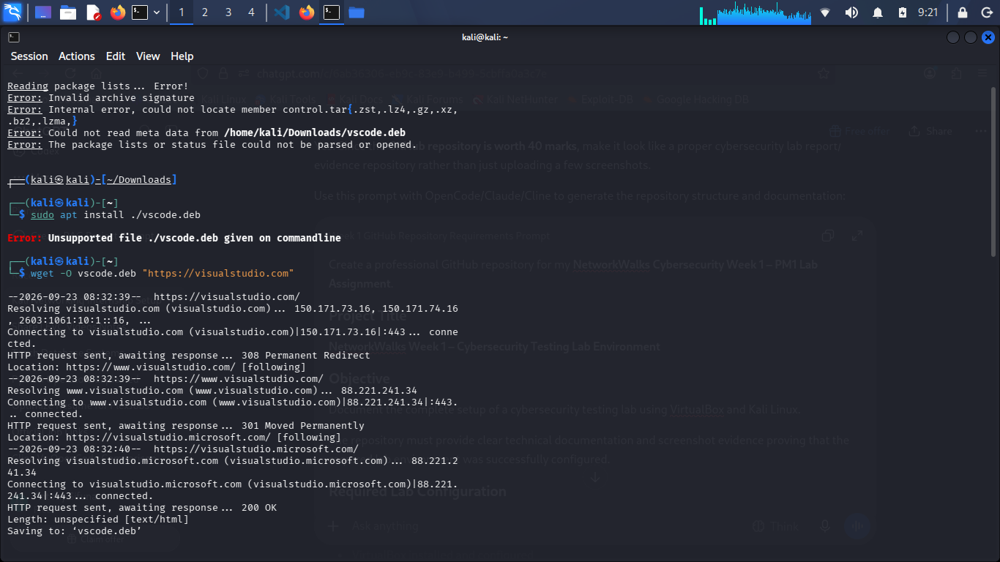

# NetworkWalks Week 1 – Cybersecurity Testing Lab Environment

**A controlled cybersecurity testing lab built with VirtualBox and Kali Linux for the NetworkWalks Week 1 – PM1 assignment.**

---

> ### Documentation Conventions
>
> * Values shown as `[FILL IN: …]` must be completed with your real values before submission.
> * No requirement is claimed as complete **unless** screenshot evidence exists under [`screenshots/`](screenshots/).
> * Screenshots that have not been captured yet are explicitly marked `(Pending — capture and add)`.
> * No passwords, API keys, or private credentials are stored anywhere in this repository.

---

## 1. Project Overview

This repository documents the complete setup of an **isolated cybersecurity testing lab environment**:

* **VirtualBox** installed and configured as the virtualization platform.
* **Kali Linux** running as a guest Virtual Machine (VM).
* A dedicated **NAT Network** (`10.0.0.0/24`) that isolates lab traffic while still providing Kali with **Internet access**.
* Kali Linux configured with the static address **`10.0.0.2/24`**.
* VirtualBox integration features enabled: **Shared Clipboard**, **Drag and Drop**, and a **Shared Folder** (`/downloads`).
* A clean **VM snapshot** taken after the lab configuration was verified.

The lab exists for **authorized, controlled cybersecurity practice only**. All testing must be limited to systems and networks where explicit permission has been granted.

**Evidence status:** `[FILL IN: evidence collection in progress / evidence complete]`

---

## 2. Lab Architecture

```text
Physical Host
     |
     | VirtualBox
     |
     +----------------------+
     | NAT Network          |
     | 10.0.0.0/24          |
     +----------------------+
              |
              |
        Kali Linux VM
        10.0.0.2/24
              |
           Internet
```

### Component explanation

| Component | Role in the lab |
| --- | --- |
| **Physical Host** | The bare-metal machine that runs VirtualBox. It is the only component that physically reaches the Internet, which keeps lab traffic logically separated from production traffic. |
| **VirtualBox** | A type-2 hypervisor that manages the VM lifecycle: virtual CPU/RAM/disk, virtual network adapters, shared folders, clipboard, and snapshots. |
| **NAT Network (10.0.0.0/24)** | A VirtualBox internal network shared by VMs. It provides private addressing in `10.0.0.0/24`, a gateway at `10.0.0.1`, and outbound Internet access, which is translated by the host. VMs on the NAT Network cannot be reached from the external LAN. |
| **Kali Linux VM (10.0.0.2/24)** | A Debian-based penetration-testing distribution used to run the lab exercises. Its static address is predictable and reproducible for every session. |
| **Internet** | Reachable from Kali for tooling and updates, but only via NAT translation on the host — no inbound exposure. |

---

## 3. Hardware / Software

> Values below that are not yet recorded are left as placeholders. Do not fill them in with guessed values.

| Component | Specification | How to verify |
| --- | --- | --- |
| Host operating system | `[FILL IN: e.g. Kali Linux 2026.x / Windows 11]` | `hostnamectl` (Linux) or **Settings → System → About** (Windows) |
| Host CPU | `[FILL IN: model and core count]` | `lscpu` (Linux) or **Task Manager** (Windows) |
| Host RAM | `[FILL IN: total memory]` | `free -h` (Linux) or **Task Manager** (Windows) |
| Host storage | `[FILL IN: total disk]` | `df -h` / `lsblk` (Linux) |
| VirtualBox version | `[FILL IN: e.g. 7.2.x]` | `VBoxManage --version` or **Help → About VirtualBox** |
| Kali Linux version | `[FILL IN: release + kernel]` | `cat /etc/os-release` and `uname -r` |
| Kali VM resources | `[FILL IN: vCPU / RAM / disk allocated]` | VM **Settings → System / Storage** |

**VirtualBox** — the current stable release available from the official VirtualBox website at the time of setup was used, and the exact installed version must be recorded above. Screenshot `01` documents the installed version.

### `screenshots/01-virtualbox-version.png` — VirtualBox Version (Pending)


* **What is shown:** The VirtualBox **Help → About** window or the output of `VBoxManage --version`.
* **Requirement proven:** VirtualBox is installed and its exact version is documented.
* **Expected result:** A clear version string, e.g. `7.2.x rXXXXX`, and the "Oracle VM VirtualBox Manager" title bar.

---

## 4. Network Configuration

| Parameter | Value |
| --- | --- |
| Network Type | NAT Network |
| Network | 10.0.0.0/24 |
| Kali IP Address | 10.0.0.2/24 |
| Subnet Mask | 255.255.255.0 |
| Gateway (supporting) | 10.0.0.1 (VirtualBox NAT Network default gateway) |
| DNS (supporting) | `[FILL IN: e.g. 8.8.8.8]` |

### Why a dedicated lab network is useful for cybersecurity practice

1. **Isolation** — Lab traffic stays inside a private virtual network and never touches the home/office LAN.
2. **Deterministic addressing** — A static `10.0.0.2/24` means every session (and every script or report) references the same address.
3. **Reproducibility** — The environment can be rebuilt to an identical state after snapshots or experiments.
4. **Controlled egress** — Outbound access is NAT'd through the host, so the VM can reach the Internet for tools/updates while remaining unreachable from outside.
5. **Safety** — An attacker-controlled target VM on this network cannot accidentally scan or disrupt production devices.

### `screenshots/02-nat-network.png` — NAT Network Definition (Pending)


* **What is shown:** **File → Tools → Network Manager** with the configured NAT Network.
* **Requirement proven:** A NAT Network exists and uses `10.0.0.0/24`, mask `255.255.255.0`.
* **Expected result:** Network named e.g. `NWLabNet` with **Network Address:** `10.0.0.0`, **Network Mask:** `255.255.255.0`.

---

## 5. Kali Verification

The following commands verify the guest network configuration. Each command has a specific purpose:

| Command | Purpose | Expected result |
| --- | --- | --- |
| `ip addr` | Lists all network interfaces and their assigned IPv4/IPv6 addresses. | The active interface (e.g. `eth0`/`enp0s3`) shows `inet 10.0.0.2/24`. |
| `ip route` | Shows the kernel routing table (default gateway and connected routes). | `default via 10.0.0.1 dev <iface>` and `10.0.0.0/24 dev <iface> proto kernel scope link`. |
| `nmcli connection show` | Lists NetworkManager connection profiles and their active state. | The configured connection is `connected` and assigned to the device. |
| `ping -c 4 8.8.8.8` | Tests IPv4 reachability to a public host (Google DNS) to prove Internet egress. | 4 packets transmitted, 4 received, **0% packet loss**. |

### `screenshots/04-kali-ip-address.png` — Kali IP Address


* **What is shown:** Output of `ip addr` inside the Kali VM.
* **Requirement proven:** Kali is configured at `10.0.0.2/24` on the lab network.
* **Expected result:** `inet 10.0.0.2/24 scope global` on the active interface.

### `screenshots/05-routing-table.png` — Routing Table


* **What is shown:** Output of `ip route` inside the Kali VM.
* **Requirement proven:** The default gateway and connected subnet are correctly configured.
* **Expected result:** A default route via `10.0.0.1` and a `10.0.0.0/24` link route.

### `screenshots/06-nmcli-connection.png` — NetworkManager Connection


* **What is shown:** Output of `nmcli connection show`.
* **Requirement proven:** NetworkManager manages a connection that is active on the network device.
* **Expected result:** Connection `NAME`/`UUID`/`DEVICE` populated and state `connected`.

> **Note:** `04`, `05`, and this screenshot together prove the static IP, subnet mask, and routing of `10.0.0.2/24`. Review each file once more before submission to confirm it shows the intended command.

---

## 6. VirtualBox Configuration

The following settings are configured on the Kali VM:

| Setting | Configuration |
| --- | --- |
| Network adapter 1 | Attached to **NAT Network** (`10.0.0.0/24`), cable connected |
| Shared Clipboard | Enabled (direction `[FILL IN: Bidirectional / Host-to-Guest]`) |
| Drag and Drop | Enabled (direction `[FILL IN: Bidirectional / Host-to-Guest]`) |
| Shared Folder | Host folder `[FILL IN: absolute host path, e.g. /home/<user>/Downloads]` mounted at `/downloads` in Kali (Auto-mount, Permanent) |

> **Prerequisite:** Shared Clipboard, Drag and Drop, and Shared Folders require **VirtualBox Guest Additions** to be installed inside the Kali guest (`[FILL IN: installed / pending]`). Verify with `VBoxService --version` or `lsmod | grep vboxguest`.

### `screenshots/03-kali-network-adapter.png` — Network Adapter (Pending)


* **What is shown:** VM **Settings → Network → Adapter 1**.
* **Requirement proven:** The adapter is attached to the NAT Network.
* **Expected result:** "Attached to: NAT Network", correct network selected, "Cable connected" ticked.

### `screenshots/07-shared-clipboard.png` — Shared Clipboard (Pending)


* **What is shown:** VM **Settings → General → Advanced → Shared Clipboard**.
* **Requirement proven:** Shared Clipboard is enabled.
* **Expected result:** Shared Clipboard set to `Bidirectional` (or the chosen direction).

### `screenshots/08-drag-and-drop.png` — Drag and Drop (Pending)


* **What is shown:** VM **Settings → General → Advanced → Drag and Drop**.
* **Requirement proven:** Drag and Drop is enabled.
* **Expected result:** Drag and Drop set to `Bidirectional` (or the chosen direction).

### `screenshots/09-shared-folder.png` — Shared Folder (Pending)


* **What is shown:** VM **Settings → Shared Folders**.
* **Requirement proven:** A shared folder exists for the host `[FILL IN: downloads]` folder.
* **Expected result:** Folder path `[FILL IN: host path]`, name `downloads`, **Auto-mount** and **Permanent** enabled.

### `screenshots/10-downloads-folder.png` — Shared Folder Inside Kali (Pending)


* **What is shown:** `ls /downloads` (and mount info) inside the Kali VM.
* **Requirement proven:** The shared folder is mounted and readable inside Kali.
* **Expected result:** The mounted `/downloads` directory lists host files (or is at least accessible, e.g. via `df -h | grep downloads`).

---

## 7. Internet Connectivity

Internet access from Kali is verified by sending four ICMP echo requests to `8.8.8.8`:

```bash
ping -c 4 8.8.8.8
```

**Interpreting the result:**

* **0% packet loss, 4/4 received** → Kali can route packets out through the NAT Network gateway (`10.0.0.1`) and reach the public Internet. This proves the NAT Network egress path works.
* If packets are lost from the first hop only, the gateway may be dropping ICMP — check the route and NAT Network attachment first.
* If `ping 8.8.8.8` works but hostnames fail, DNS is the issue (verify `ipv4.dns` on the connection).

### `screenshots/06-internet-connectivity.png` — Internet Connectivity



* **What is shown:** Output of `ping -c 4 8.8.8.8` inside Kali.
* **Requirement proven:** Kali has working Internet access through the NAT Network.
* **Expected result:** `4 packets transmitted, 4 received, 0% packet loss`.

---

## 8. Snapshot

After the lab was fully configured and verified, a clean snapshot was taken to preserve the known-good state.

| Snapshot attribute | Value |
| --- | --- |
| Snapshot name | `[FILL IN: e.g. clean-baseline]` |
| Date | `[FILL IN: YYYY-MM-DD]` |
| Purpose | Preserve a verified, clean baseline of the lab before any testing; allow instant rollback if the testing environment is corrupted or compromised. |

### Why snapshots are useful before cybersecurity testing

* **Instant rollback** — revert to a clean state after malware, exploits, or misconfiguration.
* **Known-good baseline** — always start experiments from a verified configuration.
* **Cost savings** — no need to reinstall/reconfigure the OS after destructive testing.
* **Forensic cleanliness** — test artifacts do not persist into the next test session.

### `screenshots/11-kali-snapshot.png` — VM Snapshot (Pending)


* **What is shown:** VirtualBox **Snapshots** pane showing the saved snapshot.
* **Requirement proven:** A clean snapshot exists after the successful lab configuration.
* **Expected result:** Snapshot name, date, and disk state visible in the Snapshots tab.

---

## 9. Troubleshooting

| Problem | Investigation | Solution | Result |
| --- | --- | --- | --- |
| _No incidents recorded during setup._ | — | — | — |

> Only problems **actually experienced** may be added to this table. Each incident must include the verbatim commands used and must be referenced in [`troubleshooting/troubleshooting.md`](troubleshooting/troubleshooting.md). Do not fabricate incidents.

---

## 10. Security Considerations

* **Authorized use only** — This environment exists for authorized cybersecurity practice. Testing is only performed against systems and networks where **explicit permission** has been granted.
* **Isolation** — The lab is contained inside the VirtualBox NAT Network (`10.0.0.0/24`). Lab systems are not reachable from the external LAN, which prevents accidental impact on production or home networks.
* **No secrets in the repository** — No passwords, API keys, tokens, private keys, or personal credentials are committed. Screenshots are reviewed (cropped if necessary) to remove any sensitive data before upload.
* **Housekeeping** — VM disk images (`*.vdi`, `*.vmdk`), saved states, and sensitive logs are excluded from version control (see `.gitignore`).

---

## 11. Verification Checklist

```text
[ ] VirtualBox installed
[ ] Kali Linux VM installed
[ ] NAT Network created
[ ] NAT Network uses 10.0.0.0/24
[ ] Kali configured as 10.0.0.2/24
[ ] Internet connectivity verified
[ ] Shared Clipboard enabled
[ ] Drag and Drop enabled
[ ] /downloads shared folder configured
[ ] Shared folder verified inside Kali
[ ] VM snapshot created
[ ] Screenshots captured
[ ] README completed
[ ] Troubleshooting documented
[ ] Repository reviewed before submission
```

Each item must remain **unchecked** until it is backed by real evidence. The file [`evidence/verification.md`](evidence/verification.md) is the checklist with per-item evidence mapping.

---

## Screenshot Index

| # | File | Shows | Section | Status |
| --- | --- | --- | --- | --- |
| 01 | `01-virtualbox-version.png` | Installed VirtualBox version | 3 | Pending — capture |
| 02 | `02-nat-network.png` | NAT Network 10.0.0.0/24 definition | 4 | Pending — capture |
| 03 | `03-kali-network-adapter.png` | Adapter attached to NAT Network | 6 | Pending — capture |
| 04 | `04-kali-ip-address.png` | `ip addr` → 10.0.0.2/24 | 5 | ✔ Available |
| 05 | `05-routing-table.png` | `ip route` → gateway 10.0.0.1 | 5 | ✔ Available |
| 06 | `06-internet-connectivity.png` | `ping -c 4 8.8.8.8` → 0% loss | 7 | ✔ Available |
| — | `06-nmcli-connection.png` | `nmcli connection show` | 5 | ✔ Available |
| 07 | `07-shared-clipboard.png` | Shared Clipboard setting | 6 | Pending — capture |
| 08 | `08-drag-and-drop.png` | Drag and Drop setting | 6 | Pending — capture |
| 09 | `09-shared-folder.png` | Shared Folder setting | 6 | Pending — capture |
| 10 | `10-downloads-folder.png` | `/downloads` mounted in Kali | 6 | Pending — capture |
| 11 | `11-kali-snapshot.png` | Clean VM snapshot | 8 | Pending — capture |

---

## Submission Information

```text
Course/Training: NetworkWalks Cybersecurity & Ethical Hacking
Assignment: Week 1 – PM1
Lab: Cybersecurity Testing Lab Environment
```

---

## Repository Structure

```text
networkwalks-week1-cybersecurity-lab/
│
├── README.md
│
├── screenshots/
│   ├── 04-kali-ip-address.png
│   ├── 05-routing-table.png
│   ├── 06-internet-connectivity.png
│   └── 06-nmcli-connection.png
│   (pending: 01..03, 07..11)
│
├── configuration/
│   ├── network-configuration.md
│   ├── virtualbox-configuration.md
│   └── kali-configuration.md
│
├── troubleshooting/
│   └── troubleshooting.md
│
└── evidence/
    └── verification.md
```

---

*Documentation generated for the NetworkWalks Cybersecurity & Ethical Hacking course — Week 1, PM1.*